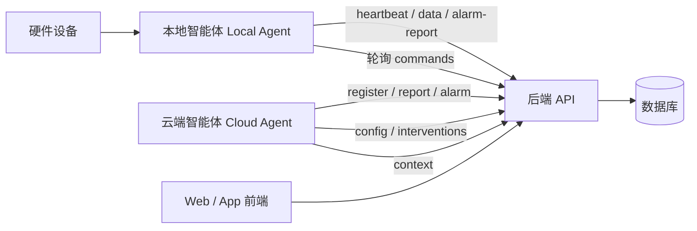

# 安心伴智慧养老守护系统 后端接口规范文档

> **文档版本**：v2.1（2026-06-02 复审）  
> **唯一对接标准**：Web 前端、App 前端、本地硬件、本地智能体、云端智能体及云平台服务均以此文档为准进行接口开发与联调。

## 1. 文档说明

本接口文档是系统**唯一的 REST API 对接规范**，用于规范 Web 前端、App 前端、**本地硬件端**、**本地智能体（Local Agent）**、**云端平台 / 云服务 / 云端智能体（Cloud Agent）** 与后端的数据交互方式。

### 1.1 适用对象与职责

| 调用方 | 角色说明 | 主要模块 |
| --- | --- | --- |
| **Web 前端** | 社区工作人员管理端 | 认证、老人、告警、工单、看板、监控申请、工作人员 |
| **App 前端** | 家属移动端 | 认证、绑定老人、健康数据、服务申请、监控审批、SOS |
| **硬件设备** | 手环、传感器、摄像头等 | `/api/device`（注册、心跳、传感器上报） |
| **本地智能体** | 社区边缘网关 / 本地 Agent | `/api/local-agent`（汇聚硬件、转发告警、拉取命令） |
| **云端智能体** | AI 决策、对话、干预执行 | `/api/cloud-agent`、`/api/agent` |
| **云平台服务** | 跨系统告警同步、配置下发 | `/api/cloud-agent`、`/api/alarm`、`/api/intervention` |

### 1.2 模块导航

| 章节 | 模块 | 主要调用方 |
| --- | --- | --- |
| §4 | 认证 `/api/auth` | 前端 |
| §5 | 老人 `/api/elder` | 前端 |
| §6 | 健康 `/api/health` | 前端、云端 |
| §7 | 告警 `/api/alarm` | 前端、云端、硬件 |
| §8 | 设备 `/api/device` | 前端、硬件 |
| §9–§15 | 工单、服务申请、监控、通知、看板、工作人员、上传 | 前端 |
| §16 | 本地智能体 `/api/local-agent` | 硬件、本地网关 |
| §17 | 云端智能体 `/api/cloud-agent` | 云端、智能体 |
| §18 | 智能体上下文 `/api/agent` | 云端、智能体 |
| §19 | 硬件与云端对接流程 | 硬件、云端 |
| §20 | 紧急联系人、健康档案、干预、SOS | 前端、云端 |
| §24 | **全量接口速查表** | 全部 |

### 1.3 对接原则

1. **以本文档为准**：新增功能先在本文档定义接口，再实现代码；代码变更须同步更新文档。
2. **统一响应格式**：所有接口返回 `ApiResponse<T>`（见 §3.1）。
3. **统一 ID 类型**：业务 ID 均为 String（`elderId`、`deviceId`、`alarmId` 等）。
4. **分端对接**：硬件优先走 Local Agent 间接上报；云端智能体走 Cloud Agent 模块；前端走业务模块。

### 1.4 对外发布说明

| 项目 | 内容 |
| --- | --- |
| **文档文件** | 请分发 `anxinban/docs/api文档.md`（v2.1），勿使用 `api文档 - 副本.md`（已过时） |
| **接口基址** | `http://{host}:{port}/api`（默认端口以部署环境为准） |
| **联调注意** | 实现局限见 **§23**；全量路径见 **§24** |
| **数据库脚本** | 初始化参考 `anxinban/docs/db_schema.sql` |

---

## 2. 约定说明

### 2.1 接口路径前缀

- 所有后端接口统一前缀：`/api`
- 各功能模块按资源分组，如：`/api/auth`、`/api/elder`、`/api/device`、`/api/alarm`、`/api/local-agent`、`/api/cloud-agent`、`/api/work-order`、`/api/health`

### 2.2 请求与响应格式

- 请求体使用 `application/json`（文件上传除外）
- 响应体使用 `application/json`
- 成功响应统一结构：

```json
{
  "code": 200,
  "message": "success",
  "data": {}
}
```

- 失败响应统一结构：

```json
{
  "code": 404,
  "message": "资源不存在",
  "data": null
}
```

> **重要**：当前后端所有接口的 **HTTP 响应状态码均为 200**（Spring 默认），业务成功/失败以响应体中的 `code` 字段为准（如 200/201/404/401）。对接时请勿仅依赖 HTTP Status Code。

### 2.3 业务状态码（响应体 code 字段）

| 状态码 | 说明 | 类型 |
| --- | --- | --- |
| 200 | 请求成功 | Number |
| 201 | 创建资源成功 | Number |
| 400 | 参数校验失败 | Number |
| 401 | 身份验证失败 | Number |
| 403 | 无权限访问 | Number |
| 404 | 资源不存在 | Number |
| 500 | 服务端异常 | Number |

### 2.4 时间格式

- 所有时间字段采用类 ISO 8601 格式：`yyyy-MM-dd'T'HH:mm:ss`（示例：`2025-12-19T10:00:00`）
- 后端接收时截取前 19 位进行解析

### 2.5 分页规范

多数列表接口使用 `page` + `pageSize` 参数，返回 `PageResult<T>` 结构：

| 字段 | 说明 | 类型 |
| --- | --- | --- |
| list | 数据列表 | Array |
| total | 总记录数 | Number |
| page | 当前页码 | Number |
| pageSize | 每页大小 | Number |

**例外**（使用 `size` 而非 `pageSize`，且返回 `Array` 而非 `PageResult`）：

| 模块 | 接口 | 分页参数 |
| --- | --- | --- |
| 干预 | `GET /api/intervention/list` | `page` + `size` |
| 设备传感器历史 | `GET /api/device/{deviceId}/sensor-data` | `page` + `pageSize`，返回 `Array` |

### 2.6 硬件与云端对接约定

- 硬件设备优先通过本地网关（Local Agent）间接上报；也可直连 `/api/device` 系列接口
- 本地智能体定时调用 `POST /api/local-agent/heartbeat` 维持在线状态
- 云端智能体启动时调用 `POST /api/cloud-agent/register`，运行中调用 `POST /api/cloud-agent/report` 汇报状态
- 告警上报推荐路径：本地网关 → `POST /api/local-agent/alarm-report`；跨系统同步 → `POST /api/cloud-agent/alarm`
- 设备控制采用「下发命令 → 本地代理轮询拉取 → 执行后上报」模式
- 鉴权：当前后端未强制 Token 校验；生产环境建议在 Header 中携带 `Authorization: Bearer <token>` 或 `X-Device-Id` + 预共享密钥

### 2.7 时间范围参数命名

| 模块 | 接口 | 参数名 | 可选值 |
| --- | --- | --- | --- |
| 老人健康历史 | `GET /api/elder/{elderId}/health/history` | `range` | day / week / month |
| 健康趋势 | `GET /api/health/trend/{elderId}` | `period` | day / week / month |
| 健康分析 | `GET /api/health/analysis/{elderId}` | `period` | day / week / month |

---

## 3. 通用数据定义

### 3.1 响应结果封装 ApiResponse

| 字段 | 说明 | 类型 | 是否必填 |
| --- | --- | --- | --- |
| code | 状态码 | Number | 是 |
| message | 提示信息 | String | 是 |
| data | 业务数据 | Object / Array / null | 否 |

### 3.2 用户认证相关 DTO

#### LoginRequest

| 字段 | 说明 | 类型 | 是否必填 |
| --- | --- | --- | --- |
| phone | 手机号 | String | 是 |
| password | 密码 | String | 是 |
| userType | 用户类型 | String | 是（staff/family） |

#### LoginResponse

| 字段 | 说明 | 类型 |
| --- | --- | --- |
| accessToken | 访问令牌 | String |
| refreshToken | 刷新令牌 | String |
| userId | 用户业务ID | String |
| name | 姓名 | String |
| phone | 手机号 | String |
| role | 角色 | String |
| communityId | 社区ID | String |
| avatar | 头像URL | String |

#### RegisterRequest

| 字段 | 说明 | 类型 | 是否必填 |
| --- | --- | --- | --- |
| name | 姓名 | String | 是 |
| phone | 手机号 | String | 是 |
| password | 密码 | String | 是 |
| verifyCode | 验证码 | String | 否 |
| userType | 用户类型 | String | 是（staff/family） |
| elderId | 绑定老人ID | String | family时可选 |
| relation | 与老人关系 | String | family时可选 |

#### ResetPasswordRequest

| 字段 | 说明 | 类型 | 是否必填 |
| --- | --- | --- | --- |
| phone | 手机号 | String | 是 |
| verifyCode | 验证码 | String | 否 |
| newPassword | 新密码 | String | 是 |

### 3.3 智能体信息 AgentInfoDto（硬件/云端共用）

| 字段 | 说明 | 类型 | 是否必填 |
| --- | --- | --- | --- |
| agentId | 智能体唯一标识 | String | 是 |
| agentType | 智能体类型 | String | 否（如 `local_gateway`、`cloud_agent`） |
| status | 运行状态 | String | 否（如 `online`、`offline`） |
| lastHeartbeat | 最后心跳时间 | String | 否 |
| ip | IP 地址 | String | 否 |
| deviceCount | 管理设备总数 | Number | 否 |
| connectedDevices | 当前连接设备数 | Number | 否 |
| faults | 故障列表 | Array\<Fault\> | 否 |

#### Fault 子结构

| 字段 | 说明 | 类型 |
| --- | --- | --- |
| deviceId | 故障设备 ID | String |
| faultCode | 故障码 | String |
| message | 故障描述 | String |

### 3.4 传感器数据 SensorData（DeviceDto 内嵌）

| 字段 | 说明 | 类型 | 是否必填 |
| --- | --- | --- | --- |
| sensorId | 传感器 ID | String | 否（上报时可不传，查询时由后端生成） |
| sensorType | 传感器类型 | String | 是（见下表） |
| value | 数值 | Number | 是 |
| unit | 单位 | String | 否 |
| timestamp | 采集时间 | String | 否 |
| status | 数据状态 | String | 否（`normal` / `alarm`；`alarm` 时后端标记为异常） |

**传感器类型与 value 格式对照**

| sensorType | value 含义 | value 示例 | 后端映射 |
| --- | --- | --- | --- |
| `heart_rate` | 心率（bpm） | `72` | 直接返回 |
| `temperature` | 体温（℃） | `36.5` | 直接返回 |
| `blood_pressure_sys` | 收缩压（mmHg，仅存 sensor_data） | `125` | 不映射到 HealthLatestDto |
| `blood_pressure_dia` | 舒张压（mmHg，仅存 sensor_data） | `82` | 不映射到 HealthLatestDto |
| `blood_oxygen` | 血氧饱和度（%） | `98` | 直接返回 |
| `insomnia` | 失眠等级（0-3） | `0` | `0`→`无`，`1`→`轻度`，`2`→`中度`，`3`→`重度` |
| `sleep_time` | 入睡时间（小时，支持小数） | `22.5` | `22.5`→`22:30` |

> **血压说明**：`HealthLatestDto` 中的 `systolic`/`diastolic` 来自独立表 `blood_pressure`，**不是**由 `sensor_data` 中的 `blood_pressure_sys`/`blood_pressure_dia` 自动汇总。当前无写入 `blood_pressure` 表的 HTTP 接口，硬件若上报 `blood_pressure_sys`/`blood_pressure_dia` 仅存入 `sensor_data`，不会出现在最新健康接口中。

### 3.5 设备控制命令 Command（DeviceDto 内嵌）

| 字段 | 说明 | 类型 |
| --- | --- | --- |
| commandId | 命令编号 | String |
| deviceId | 目标设备 ID | String |
| commandType | 命令类型 | String（如 `alarmMute`） |
| parameters | 命令参数 | Object |
| status | 命令状态 | String（默认 `pending`） |
| timestamp | 创建时间 | String |

---

## 4. 认证模块 (/api/auth)

### 4.1 用户登录

- **接口**：`POST /api/auth/login`
- **说明**：工作人员或家属登录
- **请求体**：LoginRequest
- **响应**：LoginResponse

> **注意**：当前实现中 `verifyCode` 字段仅做占位，后端未做验证码校验。

### 4.2 用户注册

- **接口**：`POST /api/auth/register`
- **说明**：工作人员或家属注册
- **请求体**：RegisterRequest
- **响应**：LoginResponse

### 4.3 重置密码

- **接口**：`POST /api/auth/reset-password`
- **说明**：根据手机号重置密码
- **请求体**：

```json
{
  "phone": "13800138001",
  "newPassword": "654321"
}
```

- **响应**：`{ "code": 200, "message": "success", "data": null }`（用户不存在时返回 404）

### 4.4 退出登录

- **接口**：`POST /api/auth/logout`
- **说明**：用户退出登录
- **响应**：`{ "code": 200, "message": "success", "data": null }`

### 4.5 获取当前用户信息

- **接口**：`GET /api/auth/me`
- **说明**：根据手机号获取当前用户信息（当前实现为工作人员查询）
- **查询参数**：

| 参数 | 说明 | 是否必填 |
| --- | --- | --- |
| phone | 手机号 | 是 |

- **响应**：StaffDto（非 LoginResponse）；用户不存在时返回 404

---

## 5. 老人管理模块 (/api/elder)

### 5.1 创建老人

- **接口**：`POST /api/elder`
- **说明**：创建老人档案
- **请求体**：ElderDto
- **响应**：ElderDto

### 5.2 获取老人详情

- **接口**：`GET /api/elder/{elderId}`
- **说明**：获取老人基本信息
- **响应**：ElderDto

#### ElderDto 字段说明

| 字段 | 说明 | 类型 |
| --- | --- | --- |
| elderId | 老人业务ID | String |
| name | 姓名 | String |
| gender | 性别 | String |
| age | 年龄 | Number |
| phone | 手机号 | String |
| guardianPhone | 监护人电话 | String |
| healthStatus | 健康状态编码 | String（normal/warning/danger） |
| healthStatusText | 健康状态文本 | String |
| address | 住址 | String |
| building | 所在楼栋 | String |
| roomNumber | 房间号 | String |
| healthNote | 健康备注 | String |
| familyPhone | 家属电话 | String |
| avatar | 头像URL | String |
| hasCamera | 是否有摄像头 | Boolean |
| cameraAuthUntil | 监控授权到期时间戳 | Number（0表示无权限） |
| cameraPending | 是否有待审批监控申请 | Boolean |
| lastOnline | 最后在线时间 | String |
| tags | 健康标签列表 | Array<String> |

### 5.3 获取老人完整档案

- **接口**：`GET /api/elder/detail/{elderId}`
- **说明**：获取老人完整档案（基本信息 + 健康数据 + 设备 + 告警 + 工单）
- **响应**：

```json
{
  "basicInfo": { ...ElderDto },
  "healthData": { ...HealthLatestDto },
  "devices": [ ...DeviceDto ],
  "alarms": [ ...AlarmDto ],
  "workOrders": [ ...WorkOrderDto ]
}
```

### 5.4 分页查询老人列表

- **接口**：`GET /api/elder/list`
- **说明**：社区老人列表，支持筛选和分页
- **查询参数**：

| 参数 | 说明 | 是否必填 |
| --- | --- | --- |
| name | 姓名模糊搜索 | 否 |
| building | 楼栋精确筛选 | 否 |
| roomNumber | 房间号模糊搜索 | 否 |
| healthStatus | 健康状态筛选 | 否 |
| page | 页码（默认1） | 否 |
| pageSize | 每页大小（默认20） | 否 |

- **响应**：`PageResult<ElderDto>`

### 5.5 获取App绑定的老人

- **接口**：`GET /api/elder/bound`
- **说明**：App端获取家属绑定的老人信息
- **查询参数**：

| 参数 | 说明 | 是否必填 |
| --- | --- | --- |
| familyId | 家属业务ID | 是 |

- **响应**：ElderDto

### 5.6 更新老人信息

- **接口**：`PUT /api/elder/{elderId}`
- **说明**：更新老人档案
- **请求体**：ElderDto（只需传需要修改的字段）
- **响应**：ElderDto

### 5.7 删除老人

- **接口**：`DELETE /api/elder/{elderId}`
- **说明**：删除老人档案
- **响应**：`{ "code": 200, "message": "success", "data": null }`

### 5.8 获取老人绑定设备

- **接口**：`GET /api/elder/{elderId}/devices`
- **说明**：获取老人绑定的所有设备
- **响应**：`Array<DeviceDto>`

### 5.9 获取老人实时健康数据

- **接口**：`GET /api/elder/{elderId}/health/realtime`
- **说明**：获取老人最新健康数据
- **响应**：HealthLatestDto

### 5.10 获取老人健康历史趋势

- **接口**：`GET /api/elder/{elderId}/health/history`
- **说明**：获取老人健康数据历史趋势
- **查询参数**：

| 参数 | 说明 | 是否必填 |
| --- | --- | --- |
| type | 数据类型（heart_rate/temperature/blood_pressure） | 是 |
| range | 时间范围（day/week/month，默认week） | 否 |

- **响应**：HealthTrendDto

### 5.11 获取摄像头推流地址

- **接口**：`GET /api/elder/{elderId}/camera-stream`
- **说明**：获取老人室内摄像头推流地址（需有监控权限）
- **查询参数**：

| 参数 | 说明 | 是否必填 |
| --- | --- | --- |
| staffId | 工作人员ID | 否 |

- **响应**：`{ "streamUrl": "rtsp://example.com/stream/{elderId}" }`

---

## 6. 健康数据模块 (/api/health)

### 6.1 获取最新健康数据

- **接口**：`GET /api/health/latest/{elderId}`
- **说明**：获取老人最新体征数据
- **响应**：HealthLatestDto

#### HealthLatestDto 字段说明

| 字段 | 说明 | 类型 |
| --- | --- | --- |
| elderId | 老人ID | String |
| temperature | 体温（℃） | Number |
| heartRate | 心率（bpm） | Number |
| systolic | 收缩压（mmHg） | Number |
| diastolic | 舒张压（mmHg） | Number |
| bloodOxygen | 血氧饱和度（%） | Number |
| insomnia | 失眠等级 | String（无/轻度/中度/重度） |
| sleepTime | 入睡时间 | String |
| updateTime | 数据更新时间 | String |

### 6.2 获取健康趋势

- **接口**：`GET /api/health/trend/{elderId}`
- **说明**：获取健康数据趋势
- **查询参数**：

| 参数 | 说明 | 是否必填 |
| --- | --- | --- |
| type | 数据类型 | 是 |
| period | 时间范围（day/week/month，默认week） | 否 |

- **响应**：HealthTrendDto

### 6.3 获取健康分析

- **接口**：`GET /api/health/analysis/{elderId}`
- **说明**：获取AI健康分析报告
- **查询参数**：

| 参数 | 说明 | 是否必填 |
| --- | --- | --- |
| period | 时间范围（day/week/month，默认week） | 否 |

- **响应**：HealthAnalysisDto

| 字段 | 说明 | 类型 |
| --- | --- | --- |
| elderId | 老人ID | String |
| period | 分析周期 | String |
| summary | 健康总结 | String |
| suggestion | 健康建议 | String |

### 6.4 获取健康异常告警

- **接口**：`GET /api/health/abnormal/{elderId}`
- **说明**：获取老人健康异常告警列表
- **查询参数**：

| 参数 | 说明 | 是否必填 |
| --- | --- | --- |
| status | 告警状态筛选 | 否 |
| page | 页码（默认1） | 否 |
| pageSize | 每页大小（默认20） | 否 |

- **响应**：`PageResult<AlarmDto>`

---

## 7. 告警管理模块 (/api/alarm)

### 7.1 创建告警

- **接口**：`POST /api/alarm`
- **说明**：创建告警事件（前端、云端、硬件均可调用）
- **请求体**：AlarmDto
- **响应**：AlarmDto（HTTP 业务码 201）

> **必填字段**：`alarmId`、`elderId`、`alarmType`、`severity`。通过 `/api/local-agent/alarm-report` 上报时，`alarmId` 和 `severity` 可由后端自动补全。

#### AlarmDto 字段说明

| 字段 | 说明 | 类型 |
| --- | --- | --- |
| alarmId | 告警业务ID | String |
| elderId | 老人ID | String |
| elderName | 老人姓名 | String |
| deviceId | 设备ID | String |
| alarmType | 告警类型 | String |
| severity | 严重等级 | String（critical/high/medium/low） |
| description | 描述 | String |
| status | 处理状态 | String（pending/handled） |
| isRead | 是否已读 | Boolean |
| occurTime | 发生时间 | String |
| handleTime | 处理时间 | String |
| handler | 处理人ID | String |
| handlerName | 处理人姓名 | String |
| remark | 处理备注 | String |
| building | 楼栋 | String |
| roomNumber | 房间号 | String |
| unit | 单元 | String |
| snapshotUrl | 抓拍快照URL | String |

### 7.2 获取告警详情

- **接口**：`GET /api/alarm/{alarmId}`
- **说明**：获取告警详情
- **响应**：AlarmDto

### 7.3 分页查询告警列表

- **接口**：`GET /api/alarm/list`
- **说明**：通用告警列表查询
- **查询参数**：

| 参数 | 说明 | 是否必填 |
| --- | --- | --- |
| elderId | 老人ID筛选 | 否 |
| deviceId | 设备ID筛选 | 否 |
| alarmType | 告警类型筛选 | 否 |
| status | 状态筛选 | 否 |
| startTime | 开始时间 | 否 |
| endTime | 结束时间 | 否 |
| page | 页码（默认1） | 否 |
| pageSize | 每页大小（默认20） | 否 |

- **响应**：`PageResult<AlarmDto>`

### 7.4 查询陌生人闯入告警列表

- **接口**：`GET /api/alarm/intrusion/list`
- **说明**：陌生人闯入告警列表（Web端专用）
- **查询参数**：

| 参数 | 说明 | 是否必填 |
| --- | --- | --- |
| status | 状态筛选（pending/handled） | 否 |
| building | 楼栋筛选 | 否 |
| page | 页码（默认1） | 否 |
| pageSize | 每页大小（默认20） | 否 |

- **响应**：`PageResult<AlarmDto>`

### 7.5 获取闯入告警快照

- **接口**：`GET /api/alarm/intrusion/{alarmId}/snapshot`
- **说明**：获取闯入告警抓拍快照URL
- **响应**：`{ "snapshotUrl": "..." }`

### 7.6 确认告警

- **接口**：`PUT /api/alarm/{alarmId}/acknowledge`
- **说明**：确认收到告警
- **请求体**：

```json
{
  "handler": "staff_001",
  "handleTime": "2025-05-17T10:00:00"
}
```

- **响应**：AlarmDto（状态变为 handled）

### 7.7 处理告警

- **接口**：`PUT /api/alarm/{alarmId}/resolve`
- **说明**：标记告警已处理
- **请求体**：

```json
{
  "handler": "staff_001",
  "handleTime": "2025-05-17T10:00:00",
  "remark": "已确认是访客"
}
```

- **响应**：AlarmDto（状态变为 handled）

### 7.8 标记告警已读

- **接口**：`PUT /api/alarm/{alarmId}/read`
- **说明**：将告警标记为已读
- **响应**：AlarmDto

### 7.9 获取未读告警数量

- **接口**：`GET /api/alarm/unread-count`
- **说明**：获取老人未读告警数量
- **查询参数**：

| 参数 | 说明 | 是否必填 |
| --- | --- | --- |
| elderId | 老人ID | 是 |

- **响应**：`{ "count": 3 }`

---

## 8. 设备管理模块 (/api/device)

> **调用方**：Web 前端（查询/管理）、硬件设备 / 本地网关（注册、上报、心跳）

### 8.1 前端设备列表

- **接口**：`GET /api/device/list`
- **说明**：设备管理列表（前端分页）
- **查询参数**：

| 参数 | 说明 | 是否必填 |
| --- | --- | --- |
| status | 状态筛选 | 否 |
| deviceType | 设备类型筛选 | 否 |
| location | 位置筛选（精确匹配） | 否 |
| page | 页码（默认1） | 否 |
| pageSize | 每页大小（默认20） | 否 |

- **响应**：`PageResult<DeviceDto>`

#### DeviceDto 字段说明

| 字段 | 说明 | 类型 |
| --- | --- | --- |
| deviceId | 设备业务ID | String |
| elderId | 老人ID | String |
| elderName | 老人姓名 | String |
| deviceType | 设备类型 | String（手环/床垫传感器/摄像头/门禁/烟感） |
| deviceName | 设备名称 | String |
| status | 状态 | String（如 `online`、`offline`） |
| lastHeartbeat | 最后心跳时间 | String |
| location | 安装位置 | String |
| building | 所在楼栋 | String |
| room | 房间号 | String |
| batteryLevel | 电量百分比 | Number |
| connectedDevices | 连接设备数 | Number |
| sensorDataList | 传感器数据列表 | Array |

### 8.2 查询设备详情

- **接口**：`GET /api/device/{deviceId}`
- **说明**：查询单个设备信息
- **响应**：DeviceDto；设备不存在时返回 `code: 404`

### 8.3 设备注册（硬件端）

- **接口**：`POST /api/device/register`
- **说明**：硬件设备首次上线注册；`deviceId` 必填，未传 `status` 时默认 `online`
- **请求体**：DeviceDto（至少包含 `deviceId`、`elderId`）
- **响应**：DeviceDto（HTTP 业务码 201）

**请求示例**：

```json
{
  "deviceId": "DEV-1001",
  "elderId": "ELD-5001",
  "deviceType": "手环",
  "location": "A栋1层101",
  "lastHeartbeat": "2026-05-14T08:30:12"
}
```

### 8.4 更新设备状态（硬件端）

- **接口**：`PUT /api/device/{deviceId}/status`
- **说明**：硬件定时上报在线状态与心跳
- **请求体**：

```json
{
  "status": "online",
  "lastHeartbeat": "2026-05-14T08:35:00"
}
```

- **响应**：DeviceDto

### 8.5 上报传感器数据（硬件端）

- **接口**：`POST /api/device/{deviceId}/sensor-data`
- **说明**：设备或本地网关上报传感器数据；`status` 为 `alarm` 时后端写入异常标记
- **请求体**：

```json
{
  "sensorDataList": [
    {
      "sensorType": "heart_rate",
      "value": 85,
      "unit": "次/分",
      "timestamp": "2026-05-14T08:32:10",
      "status": "normal"
    }
  ]
}
```

- **响应**：`{ "code": 200, "message": "success", "data": null }`；设备不存在时返回 404

### 8.6 查询历史传感器数据

- **接口**：`GET /api/device/{deviceId}/sensor-data`
- **说明**：查询设备历史传感器数据（内存分页）
- **查询参数**：

| 参数 | 说明 | 是否必填 |
| --- | --- | --- |
| sensorType | 传感器类型 | 否 |
| startTime | 开始时间 | 否 |
| endTime | 结束时间 | 否 |
| page | 页码（默认1） | 否 |
| pageSize | 每页大小（默认20） | 否 |

- **响应**：`Array<SensorData>`

### 8.7 发送控制指令

- **接口**：`POST /api/device/{deviceId}/command`
- **说明**：前端或云端向设备下发控制命令；命令进入 `pending` 队列，由本地代理轮询拉取
- **请求体**：

```json
{
  "commandType": "alarmMute",
  "commandId": "CMD-3001",
  "parameters": { "duration": 300 }
}
```

> `commandId` 不传时后端自动生成（格式 `CMD-{timestamp}`）

- **响应**：DeviceDto.Command（`status` 为 `pending`）

---

## 9. 工单管理模块 (/api/work-order)

### 9.1 分页查询工单列表

- **接口**：`GET /api/work-order/list`
- **说明**：工单管理列表
- **查询参数**：

| 参数 | 说明 | 是否必填 |
| --- | --- | --- |
| keyword | 工单编号关键词 | 否 |
| elderName | 老人姓名关键词 | 否 |
| status | 状态筛选 | 否 |
| page | 页码（默认1） | 否 |
| pageSize | 每页大小（默认20） | 否 |

- **响应**：`PageResult<WorkOrderDto>`

#### WorkOrderDto 字段说明

| 字段 | 说明 | 类型 |
| --- | --- | --- |
| orderId | 工单业务ID | String |
| elderId | 老人ID | String |
| elderName | 老人姓名 | String |
| orderType | 工单类型 | String |
| description | 描述 | String |
| status | 状态 | String（待分配/处理中/已完成） |
| creatorId | 创建人ID | String |
| handlerId | 处理人ID | String |
| handlerName | 处理人姓名 | String |
| handlerPhone | 处理人电话 | String |
| createTime | 创建时间 | String |
| completeTime | 完成时间 | String |
| updateTime | 更新时间 | String |
| serviceRequestId | 关联服务申请ID | String |

### 9.2 获取工单详情

- **接口**：`GET /api/work-order/{orderId}`
- **说明**：获取工单详情
- **响应**：WorkOrderDto

### 9.3 创建工单

- **接口**：`POST /api/work-order`
- **说明**：创建新工单
- **请求体**：WorkOrderDto
- **响应**：WorkOrderDto

### 9.4 更新工单状态

- **接口**：`PUT /api/work-order/{orderId}/status`
- **说明**：更新工单状态
- **请求体**：

```json
{
  "status": "处理中"
}
```

> 状态枚举：`待分配`、`处理中`、`已完成`

- **响应**：WorkOrderDto

### 9.5 分配处理人

- **接口**：`PUT /api/work-order/{orderId}/assign`
- **说明**：为工单分配处理人（状态自动变为"处理中"）
- **请求体**：

```json
{
  "handlerId": "staff_002",
  "handlerName": "李秀英"
}
```

- **响应**：WorkOrderDto

---

## 10. 服务申请模块 (/api/service-request)

### 10.1 提交服务申请

- **接口**：`POST /api/service-request`
- **说明**：App端家属提交服务申请
- **请求体**：ServiceRequestDto
- **响应**：ServiceRequestDto

#### ServiceRequestDto 字段说明

| 字段 | 说明 | 类型 |
| --- | --- | --- |
| requestId | 申请业务ID | String |
| familyId | 家属ID | String |
| familyName | 家属姓名 | String |
| elderId | 老人ID | String |
| elderName | 老人姓名 | String |
| requestType | 申请类型 | String（上门看护/设备维修/健康咨询/紧急求助/生活物资代购） |
| content | 申请内容 | String |
| status | 状态 | String |
| relatedOrderId | 关联工单ID | String |
| rejectReason | 拒绝原因 | String |
| createTime | 创建时间 | String |
| updateTime | 更新时间 | String |

### 10.2 获取我的申请列表

- **接口**：`GET /api/service-request/my-list`
- **说明**：App端获取家属提交的申请列表
- **查询参数**：

| 参数 | 说明 | 是否必填 |
| --- | --- | --- |
| familyId | 家属业务ID | 是 |

- **响应**：`Array<ServiceRequestDto>`

### 10.3 获取申请状态

- **接口**：`GET /api/service-request/{requestId}/status`
- **说明**：获取申请详情及状态
- **响应**：ServiceRequestDto

### 10.4 查询服务申请列表（Web端）

- **接口**：`GET /api/service-request/list`
- **说明**：Web端管理所有服务申请
- **查询参数**：

| 参数 | 说明 | 是否必填 |
| --- | --- | --- |
| requestType | 申请类型筛选 | 否 |
| status | 状态筛选 | 否 |
| page | 页码（默认1） | 否 |
| pageSize | 每页大小（默认20） | 否 |

> Web端状态枚举：`pending`（待处理）、`approved`（已通过）、`rejected`（已拒绝）

- **响应**：`PageResult<ServiceRequestDto>`

### 10.5 转换为工单

- **接口**：`POST /api/service-request/{requestId}/convert`
- **说明**：将服务申请转为工单
- **请求体**：

```json
{
  "orderId": "WO20260522001"
}
```

- **响应**：ServiceRequestDto（状态变为 converted）

### 10.6 拒绝申请

- **接口**：`POST /api/service-request/{requestId}/reject`
- **说明**：拒绝服务申请
- **请求体**：

```json
{
  "reason": "暂不需要上门服务"
}
```

- **响应**：ServiceRequestDto（状态变为 rejected）

---

## 11. 监控申请模块 (/api/monitor-request)

### 11.1 创建监控申请

- **接口**：`POST /api/monitor-request`
- **说明**：工作人员向家属发起监控查看申请
- **请求体**：MonitorRequestDto
- **响应**：MonitorRequestDto

#### MonitorRequestDto 字段说明

| 字段 | 说明 | 类型 |
| --- | --- | --- |
| requestId | 申请业务ID | String |
| elderId | 老人ID | String |
| elderName | 老人姓名 | String |
| staffId | 工作人员ID | String |
| staffName | 申请人姓名 | String |
| staffPhone | 申请人电话 | String |
| reason | 申请原因 | String |
| status | 状态 | String（pending/approved/rejected/none） |
| approvedAt | 批准时间戳 | String |
| expiredAt | 权限过期时间 | String |
| createTime | 创建时间 | String |
| updateTime | 更新时间 | String |

### 11.2 获取家属端申请列表

- **接口**：`GET /api/monitor-request/list/family`
- **说明**：App端获取该家属绑定老人的监控申请
- **查询参数**：

| 参数 | 说明 | 是否必填 |
| --- | --- | --- |
| familyId | 家属业务ID | 是 |

- **响应**：`Array<MonitorRequestDto>`

### 11.3 获取工作人员端申请列表

- **接口**：`GET /api/monitor-request/list/staff`
- **说明**：Web端获取该工作人员发起的监控申请
- **查询参数**：

| 参数 | 说明 | 是否必填 |
| --- | --- | --- |
| staffId | 工作人员ID | 是 |

- **响应**：`Array<MonitorRequestDto>`

### 11.4 同意监控申请

- **接口**：`POST /api/monitor-request/{requestId}/approve`
- **说明**：家属同意监控申请
- **响应**：MonitorRequestDto（状态变为 approved，expiredAt 设为24小时后）

### 11.5 拒绝监控申请

- **接口**：`POST /api/monitor-request/{requestId}/reject`
- **说明**：家属拒绝监控申请
- **响应**：MonitorRequestDto（状态变为 rejected）

### 11.6 撤销监控权限

- **接口**：`POST /api/monitor-request/{requestId}/revoke`
- **说明**：撤销已批准的监控权限
- **响应**：MonitorRequestDto（状态变为 none）

### 11.7 获取申请结果

- **接口**：`GET /api/monitor-request/{requestId}/result`
- **说明**：获取监控申请详情及结果
- **响应**：MonitorRequestDto

### 11.8 检查监控权限

- **接口**：`GET /api/monitor-request/check`
- **说明**：检查工作人员是否有某老人的监控权限
- **查询参数**：

| 参数 | 说明 | 是否必填 |
| --- | --- | --- |
| elderId | 老人ID | 是 |
| staffId | 工作人员ID | 否 |

- **响应**：`{ "hasPermission": true }`

---

## 12. 通知模块 (/api/notification)

### 12.1 获取通知列表

- **接口**：`GET /api/notification/list`
- **说明**：获取用户通知列表
- **查询参数**：

| 参数 | 说明 | 是否必填 |
| --- | --- | --- |
| userId | 用户ID | 是 |
| userType | 用户类型（staff/family） | 否 |
| page | 页码（默认1） | 否 |
| pageSize | 每页大小（默认20） | 否 |

- **响应**：`PageResult<NotificationDto>`

#### NotificationDto 字段说明

| 字段 | 说明 | 类型 |
| --- | --- | --- |
| notificationId | 通知业务ID | String |
| userId | 用户ID | String |
| userType | 用户类型 | String |
| notificationType | 通知类型 | String（intrusion/camera/service） |
| title | 标题 | String |
| content | 内容 | String |
| isRead | 是否已读 | Boolean |
| building | 关联楼栋 | String |
| room | 关联房间 | String |
| orderId | 关联工单ID | String |
| requestId | 关联申请ID | String |
| elderId | 关联老人ID | String |
| relatedId | 关联业务ID | String |
| createTime | 创建时间 | String |

### 12.2 标记通知已读

- **接口**：`POST /api/notification/{notificationId}/read`
- **说明**：将单条通知标记为已读
- **响应**：`{ "code": 200, "message": "success", "data": null }`

### 12.3 标记全部已读

- **接口**：`POST /api/notification/read-all`
- **说明**：将用户所有未读通知标记为已读
- **查询参数**：

| 参数 | 说明 | 是否必填 |
| --- | --- | --- |
| userId | 用户ID | 是 |
| userType | 用户类型（staff/family） | 否 |

- **响应**：`{ "code": 200, "message": "success", "data": null }`

### 12.4 获取未读通知数量

- **接口**：`GET /api/notification/unread-count`
- **说明**：获取用户未读通知数量
- **查询参数**：

| 参数 | 说明 | 是否必填 |
| --- | --- | --- |
| userId | 用户ID | 是 |
| userType | 用户类型（staff/family） | 否 |

- **响应**：`{ "count": 5 }`

---

## 13. 社区看板模块 (/api/dashboard)

### 13.1 获取统计数据

- **接口**：`GET /api/dashboard/stats`
- **说明**：获取社区看板统计数据
- **响应**：DashboardStatsDto

#### DashboardStatsDto 字段说明

| 字段 | 说明 | 类型 |
| --- | --- | --- |
| elderTotal | 老人总数 | Number |
| todayAlarmCount | 今日告警数 | Number |
| onlineDeviceCount | 在线设备数 | Number |
| pendingOrderCount | 待处理工单数 | Number |
| healthAbnormalCount | 今日健康异常老人数 | Number |
| todayIntrusionCount | 今日闯入告警数 | Number |

### 13.2 获取楼栋列表

- **接口**：`GET /api/dashboard/buildings`
- **说明**：获取社区楼栋列表
- **响应**：`Array<String>`，如 `["1号楼", "2号楼", "3号楼"]`

---

## 14. 工作人员模块 (/api/staff)

### 14.1 获取工作人员列表

- **接口**：`GET /api/staff/list`
- **说明**：获取工作人员列表
- **查询参数**：

| 参数 | 说明 | 是否必填 |
| --- | --- | --- |
| communityId | 社区ID筛选 | 否 |

- **响应**：`Array<StaffDto>`

#### StaffDto 字段说明

| 字段 | 说明 | 类型 |
| --- | --- | --- |
| staffId | 工作人员业务ID | String |
| username | 登录账号 | String |
| name | 姓名 | String |
| phone | 手机号 | String |
| role | 角色 | String |
| communityId | 社区ID | String |
| avatar | 头像URL | String |

### 14.2 创建工作人员

- **接口**：`POST /api/staff`
- **说明**：创建工作人员账号
- **请求体**：StaffDto
- **响应**：StaffDto（默认密码为 123456）

### 14.3 更新工作人员

- **接口**：`PUT /api/staff/{staffId}`
- **说明**：更新工作人员信息
- **请求体**：StaffDto（只需传需要修改的字段）
- **响应**：StaffDto

### 14.4 删除工作人员

- **接口**：`DELETE /api/staff/{staffId}`
- **说明**：删除工作人员账号
- **响应**：`{ "code": 200, "message": "success", "data": null }`

---

## 15. 文件上传模块 (/api/upload)

### 15.1 上传头像

- **接口**：`POST /api/upload/avatar`
- **说明**：上传用户头像
- **请求类型**：`multipart/form-data`
- **参数**：

| 参数 | 说明 | 是否必填 |
| --- | --- | --- |
| file | 头像图片文件 | 是 |

- **响应**：`{ "url": "/uploads/avatar/xxx.jpg" }`

### 15.2 上传抓拍快照

- **接口**：`POST /api/upload/snapshot`
- **说明**：上传告警抓拍快照
- **请求类型**：`multipart/form-data`
- **参数**：

| 参数 | 说明 | 是否必填 |
| --- | --- | --- |
| file | 快照图片文件 | 是 |

- **响应**：`{ "url": "/uploads/snapshot/xxx.jpg" }`

---

## 16. 本地智能体模块 (/api/local-agent)

> **调用方**：部署在社区的本地网关 / 边缘计算节点，负责汇聚硬件数据、转发告警、拉取控制命令。

### 16.1 心跳上报

- **接口**：`POST /api/local-agent/heartbeat`
- **说明**：本地智能体定时上报心跳，维持在线状态；`agentId` 不存在时自动创建记录
- **请求体**：AgentInfoDto
- **响应**：`{ "code": 200, "message": "success", "data": null }`

**请求示例**：

```json
{
  "agentId": "LOCAL-1001",
  "agentType": "local_gateway",
  "status": "online",
  "ip": "10.0.0.12",
  "lastHeartbeat": "2026-05-14T08:30:10",
  "deviceCount": 12,
  "connectedDevices": 10,
  "faults": []
}
```

### 16.2 状态上报

- **接口**：`POST /api/local-agent/status`
- **说明**：上报运行状态及故障信息；请求体与 16.1 相同，当前实现逻辑与心跳一致
- **响应**：同 16.1

### 16.3 上传传感器与设备数据

- **接口**：`POST /api/local-agent/data`
- **说明**：本地智能体批量转发下属设备传感器数据至云端
- **请求体**：

| 字段 | 说明 | 类型 | 是否必填 |
| --- | --- | --- | --- |
| agentId | 本地智能体 ID | String | 是 |
| deviceId | 设备 ID | String | 是 |
| sensorDataList | 传感器数据数组 | Array\<SensorData\> | 是 |

- **响应**：同 16.1

> 后端会将 `sensorDataList` 写入设备传感器数据表（调用 DeviceService），与直连 `POST /api/device/{deviceId}/sensor-data` 效果一致。

### 16.4 告警上报

- **接口**：`POST /api/local-agent/alarm-report`
- **说明**：本地智能体上报告警事件
- **请求体**：

```json
{
  "agentId": "LOCAL-1001",
  "alarm": {
    "alarmId": "ALM-7001",
    "elderId": "ELD-5001",
    "deviceId": "DEV-1005",
    "alarmType": "fall",
    "severity": "critical",
    "description": "老人A房间跌倒告警",
    "occurTime": "2026-05-14T08:31:00"
  }
}
```

- **响应**：AlarmDto（HTTP 业务码 201）

> `alarmId` 不传时后端自动生成（格式 `ALM-{agentId}-{timestamp}`）；`severity` 不传时默认 `medium`。告警持久化至告警库，与 `POST /api/alarm`、`POST /api/cloud-agent/alarm` 效果一致。

### 16.5 拉取待执行控制命令

- **接口**：`GET /api/local-agent/{agentId}/commands`
- **说明**：本地智能体轮询获取 `status=pending` 的控制命令
- **响应**：`Array<DeviceDto.Command>`

> **代码实现注意**：当前返回全局 pending 命令池，**未按 `agentId` 过滤**。硬件联调时需自行匹配 `deviceId`。

### 16.6 上报意图识别结果

- **接口**：`POST /api/local-agent/intent`
- **说明**：本地语音/交互模块上报意图识别日志
- **请求体**：AgentIntentLog

| 字段 | 说明 | 类型 | 是否必填 |
| --- | --- | --- | --- |
| intentId | 意图记录 ID | String | 是 |
| elderId | 老人 ID | String | 是 |
| source | 来源 | String | 否 |
| userText | 用户原话 | String | 否 |
| intent | 识别意图 | String | 否 |
| confidence | 置信度 | Number | 否 |
| handledBy | 处理方 | String | 否 |

- **响应**：AgentIntentLog（HTTP 业务码 201）

### 16.7 上报家居控制日志

- **接口**：`POST /api/local-agent/control`
- **说明**：本地智能体执行家居控制后上报结果
- **请求体**：HomeControlLog

| 字段 | 说明 | 类型 | 是否必填 |
| --- | --- | --- | --- |
| controlId | 控制记录 ID | String | 是 |
| elderId | 老人 ID | String | 是 |
| deviceId | 设备 ID | String | 否 |
| command | 控制命令 | String | 否 |
| sourceAgent | 来源智能体 | String | 否 |
| result | 执行结果 | String | 否 |

- **响应**：HomeControlLog（HTTP 业务码 201）

---

## 17. 云端智能体模块 (/api/cloud-agent)

> **调用方**：部署在云端的智能体服务，负责与 AI 模型、外部系统交互，同步告警、获取配置与干预任务。

### 17.1 注册云端智能体

- **接口**：`POST /api/cloud-agent/register`
- **说明**：云端智能体首次启动注册
- **请求体**：AgentInfoDto（`agentId` 必填）
- **响应**：AgentInfoDto（HTTP 业务码 201）

### 17.2 状态汇报

- **接口**：`POST /api/cloud-agent/report`
- **说明**：云端智能体定时汇报运行状态；若 `agentId` 不存在则自动注册
- **请求体**：AgentInfoDto
- **响应**：`{ "code": 200, "message": "success", "data": null }`

### 17.3 告警同步

- **接口**：`POST /api/cloud-agent/alarm`
- **说明**：云端智能体同步告警至后端告警库（会调用 AlarmService 持久化）
- **请求体**：AlarmDto
- **响应**：AlarmDto（HTTP 业务码 201）

### 17.4 获取运行配置

- **接口**：`GET /api/cloud-agent/{agentId}/config`
- **说明**：云端智能体拉取心跳间隔、上报间隔、告警阈值等配置
- **响应**：

```json
{
  "heartbeatInterval": 30,
  "sensorUploadInterval": 10,
  "alarmThresholds": {
    "fall": true,
    "heartRateHigh": 120,
    "heartRateLow": 40
  }
}
```

> 当前为硬编码默认配置，未按 `agentId` 差异化。

### 17.5 获取干预任务

- **接口**：`GET /api/cloud-agent/{agentId}/interventions`
- **说明**：拉取干预任务列表（最多 100 条）
- **响应**：`Array<InterventionDto>`

> **代码实现注意**：当前返回**全部**干预记录（`status` 参数未生效），且未按 `agentId` 过滤。云端智能体需自行按 `elderId` 和 `status` 筛选。

### 17.6 上报干预执行结果

- **接口**：`POST /api/cloud-agent/{agentId}/intervention-result`
- **说明**：云端智能体完成干预任务后上报结果
- **请求体**：InterventionResultDto

| 字段 | 说明 | 类型 | 是否必填 |
| --- | --- | --- | --- |
| agentId | 云端智能体 ID | String | 否（路径参数已含） |
| interventionId | 干预任务 ID | String | 是 |
| status | 执行状态 | String | 是 |
| result | 执行结果描述 | String | 否 |
| timestamp | 上报时间 | String | 否 |

- **响应**：`{ "code": 200, "message": "success", "data": null }`

### 17.7 云端对话记录

- **接口**：`POST /api/cloud-agent/chat`
- **说明**：保存云端智能体与老人的对话记录
- **请求体**：AgentConversation

| 字段 | 说明 | 类型 | 是否必填 |
| --- | --- | --- | --- |
| conversationId | 对话 ID | String | 是 |
| elderId | 老人 ID | String | 是 |
| agentType | 智能体类型 | String | 否 |
| userText | 用户输入 | String | 否 |
| intent | 识别意图 | String | 否 |
| agentReply | 智能体回复 | String | 否 |
| riskLevel | 风险等级 | String | 否 |

- **响应**：AgentConversation（HTTP 业务码 201）

### 17.8 创建 AI 建议

- **接口**：`POST /api/cloud-agent/advice`
- **说明**：云端智能体写入 AI 健康/护理建议
- **请求体**：AiAdvice

| 字段 | 说明 | 类型 | 是否必填 |
| --- | --- | --- | --- |
| adviceId | 建议 ID | String | 是 |
| elderId | 老人 ID | String | 是 |
| adviceType | 建议类型 | String | 否 |
| inputSummary | 输入摘要 | String | 否 |
| adviceContent | 建议内容 | String | 否 |

- **响应**：AiAdvice（HTTP 业务码 201）

---

## 18. 智能体上下文模块 (/api/agent)

> **调用方**：云端智能体在对话/决策前拉取老人综合上下文。

### 18.1 获取老人智能体上下文

- **接口**：`GET /api/agent/context`
- **说明**：聚合老人最近健康数据、告警、干预、对话、意图等上下文，供 AI 决策使用
- **查询参数**：

| 参数 | 说明 | 是否必填 |
| --- | --- | --- |
| elderId | 老人 ID | 是 |

- **响应**：

```json
{
  "elderId": "ELD-5001",
  "recentHealth": { "heartRate": 85, "temperature": 36.5 },
  "recentAlarms": [ "...最近3条..." ],
  "recentInterventions": [ "...最近3条..." ],
  "recentConversations": [ "...最近3条..." ],
  "recentIntents": [ "...最近3条..." ]
}
```

---

## 19. 硬件与云端对接流程

### 19.1 系统架构



### 19.2 设备上线流程

1. 硬件设备连接本地网关
2. 调用 `POST /api/device/register` 注册设备（或由本地网关代注册）
3. 本地智能体启动后调用 `POST /api/local-agent/heartbeat` 上报心跳
4. 云端智能体启动后调用 `POST /api/cloud-agent/register` 注册
5. 云端智能体调用 `GET /api/cloud-agent/{agentId}/config` 拉取配置

### 19.3 数据上报流程

1. 硬件采集传感器数据
2. **方式 A（推荐）**：本地网关调用 `POST /api/local-agent/data` 批量转发
3. **方式 B（直连）**：设备调用 `POST /api/device/{deviceId}/sensor-data`
4. 后端持久化传感器数据，`status=alarm` 的记录标记为异常

### 19.4 告警处理流程

1. 硬件/本地网关检测到异常
2. 调用 `POST /api/local-agent/alarm-report`、`POST /api/alarm` 或 `POST /api/cloud-agent/alarm` 上报告警（均持久化至告警库）
3. Web/App 前端通过 `GET /api/alarm/list` 获取告警
4. 工作人员确认/处理：`PUT /api/alarm/{alarmId}/acknowledge` 或 `/resolve`
5. 如需干预，前端或云端调用 `POST /api/intervention` 创建干预任务
6. 云端智能体轮询 `GET /api/cloud-agent/{agentId}/interventions` 获取任务
7. 执行完成后调用 `POST /api/cloud-agent/{agentId}/intervention-result` 上报结果

### 19.5 设备控制流程

1. 前端/云端调用 `POST /api/device/{deviceId}/command` 下发命令（进入 pending 队列）
2. 本地智能体定时调用 `GET /api/local-agent/{agentId}/commands` 拉取 pending 命令
3. 本地网关转发命令至硬件设备执行
4. 执行结果通过 `POST /api/local-agent/control` 上报

### 19.6 硬件端实现建议

- 设备上电后优先注册，再开始定时心跳（建议间隔 30s，与 config 默认值一致）
- 传感器数据上报前做本地校验（量程、时间戳）
- 告警事件应立即上报，不应批量延迟
- 控制命令应支持幂等执行（以 `commandId` 去重）
- 网络断连时应本地缓存数据，恢复后补传

### 19.7 云平台 / 智能体对接场景

| 场景 | 调用序列 |
| --- | --- |
| 云端 Agent 启动 | `POST /api/cloud-agent/register` → `GET /api/cloud-agent/{id}/config` |
| 对话前拉上下文 | `GET /api/agent/context?elderId=` → 结合 LLM 推理 |
| 对话后写回 | `POST /api/cloud-agent/chat` |
| 生成健康建议 | `POST /api/cloud-agent/advice` |
| 跨系统告警接入 | `POST /api/cloud-agent/alarm` |
| 音乐/语音干预 | `POST /api/intervention` → CA 轮询 interventions → 执行 → intervention-result |
| 远程设备控制 | `POST /api/device/{id}/command`（由 LA 拉取执行） |

---

## 20. 其他业务模块

### 20.1 紧急联系人 (/api/emergency-contact)

> **调用方**：Web / App 前端

| 接口 | 方法 | 说明 |
| --- | --- | --- |
| `/api/emergency-contact/list?elderId=` | GET | 获取老人紧急联系人列表 |
| `/api/emergency-contact/{contactId}` | GET | 获取联系人详情 |
| `/api/emergency-contact` | POST | 创建紧急联系人 |
| `/api/emergency-contact/{contactId}` | PUT | 更新紧急联系人 |
| `/api/emergency-contact/{contactId}` | DELETE | 删除紧急联系人 |

#### EmergencyContactDto

| 字段 | 说明 | 类型 |
| --- | --- | --- |
| contactId | 联系人 ID | String |
| elderId | 老人 ID | String |
| name | 姓名 | String |
| phone | 电话 | String |
| relation | 关系 | String |
| isPrimary | 是否主联系人 | Boolean |
| sortOrder | 排序 | Number |

### 20.2 健康档案 (/api/health-record)

> **调用方**：Web / App 前端

| 接口 | 方法 | 说明 |
| --- | --- | --- |
| `/api/health-record/by-elder/{elderId}` | GET | 按老人 ID 获取健康档案 |
| `/api/health-record/{recordId}` | GET | 按档案 ID 获取健康档案 |
| `/api/health-record` | POST | 创建或更新健康档案（upsert） |

#### HealthRecordDto

| 字段 | 说明 | 类型 |
| --- | --- | --- |
| recordId | 档案 ID | String |
| elderId | 老人 ID | String |
| hospitalizationInfo | 住院信息 | String |
| medicalHistory | 病史 | String |
| allergyHistory | 过敏史 | String |
| commonMedications | 常用药物 | String |
| bloodType | 血型 | String |
| remarks | 备注 | String |

### 20.3 干预管理 (/api/intervention)

> **调用方**：Web 前端、云端智能体

| 接口 | 方法 | 说明 |
| --- | --- | --- |
| `/api/intervention/list` | GET | 干预列表（`elderId`、`status`、`priority`、`page`、`size`） |
| `/api/intervention/{interventionId}` | GET | 干预详情 |
| `/api/intervention` | POST | 创建干预记录 |
| `/api/intervention/{interventionId}` | PUT | 更新干预记录 |
| `/api/intervention/{interventionId}/complete` | PUT | 完成干预 |

#### InterventionDto

| 字段 | 说明 | 类型 |
| --- | --- | --- |
| interventionId | 干预 ID | String |
| elderId | 老人 ID | String |
| triggeredBy | 触发来源 | String |
| type | 干预类型（如 music） | String |
| priority | 优先级 | String |
| status | 状态（pending/completed 等） | String |
| operator | 操作人 | String |
| remark | 备注 | String |
| result | 执行结果 | String |
| createTime | 创建时间 | String |
| updateTime | 更新时间 | String |
| completeTime | 完成时间 | String |

### 20.4 SOS 求救 (/api/sos)

> **调用方**：App 前端（硬件可经 Local Agent 代触发）

| 接口 | 方法 | 说明 |
| --- | --- | --- |
| `/api/sos` | POST | 触发 SOS 求救 |
| `/api/sos/{sosId}` | GET | 获取 SOS 记录详情 |
| `/api/sos/list?elderId=` | GET | 获取老人 SOS 历史 |
| `/api/sos/{sosId}/handle?handlerId=` | PUT | 处理 SOS 求救 |

> **必填字段**：`POST /api/sos` 请求体需包含 `sosId`、`elderId`；`status` 由后端自动设为 `triggered`，处理后变为 `handled`（见 §21.9）。

#### SosDto

| 字段 | 说明 | 类型 |
| --- | --- | --- |
| sosId | SOS 记录 ID | String |
| elderId | 老人 ID | String |
| triggerTime | 触发时间 | String |
| status | 状态 | String |
| location | 位置 | String |
| handlerId | 处理人 ID | String |
| handledTime | 处理时间 | String |

---

## 21. 状态枚举汇总

### 21.1 老人健康状态

| 编码 | 说明 |
| --- | --- |
| normal | 正常 |
| warning | 关注 |
| danger | 高危 |

### 21.2 告警处理状态

| 编码 | 说明 |
| --- | --- |
| pending | 待处理 |
| handled | 已处理 |

### 21.3 工单状态

| 编码 | 说明 |
| --- | --- |
| 待分配 | 待分配 |
| 处理中 | 处理中 |
| 已完成 | 已完成 |

### 21.4 服务申请状态（App端）

| 编码 | 说明 |
| --- | --- |
| pending | 待处理 |
| converted | 已受理（已转工单） |
| completed | 已完成 |
| ignored | 已拒绝 |

### 21.5 服务申请状态（Web端）

| 编码 | 说明 |
| --- | --- |
| pending | 待处理 |
| approved | 已通过 |
| rejected | 已拒绝 |

### 21.6 监控申请状态

| 编码 | 说明 |
| --- | --- |
| pending | 待审批 |
| approved | 已同意 |
| rejected | 已拒绝 |
| none | 无申请/已撤销 |

### 21.7 设备类型

| 编码 | 说明 |
| --- | --- |
| 手环 | 智能手环 |
| 床垫传感器 | 床垫传感器 |
| 摄像头 | 摄像头 |
| 门禁 | 门禁 |
| 烟感 | 烟感 |

### 21.8 通知类型

| 编码 | 说明 |
| --- | --- |
| intrusion | 闯入告警 |
| camera | 监控申请 |
| service | 服务申请 |

### 21.9 SOS 状态

| 编码 | 说明 |
| --- | --- |
| triggered | 已触发 |
| handled | 已处理 |

### 21.10 干预状态

| 编码 | 说明 |
| --- | --- |
| pending | 待执行 |
| completed | 已完成 |

---

## 22. 补充说明

1. **ID 类型说明**：后端所有业务 ID 均为 String 类型（如 `elderId`、`deviceId`、`alarmId` 等），前端 App 端部分 mock 数据使用 Int 类型，实际对接时需统一为 String。
2. **时间格式**：后端统一使用 `yyyy-MM-ddTHH:mm:ss` 格式字符串进行交互，接收时截取前 19 位解析。
3. **血压字段**：Web 端展示使用 `bp` 字符串（如 `"125/82"`），API 返回拆分为 `systolic` 和 `diastolic` 两个整型字段。
4. **监控权限**：`cameraAuthUntil` 为 0 表示无权限，非 0 值为权限到期时间戳。
5. **状态编码统一**：工单状态后端返回中文（`待分配`/`处理中`/`已完成`），告警状态返回英文（`pending`/`handled`），请前端按对应枚举值处理。
6. **分页参数**：多数接口用 `pageSize`；干预列表用 `size`（见 §2.5）。
7. **服务申请筛选**：Web 端列表参数名为 `requestType`（非 `type`）。
8. **健康趋势参数**：老人模块用 `range`，健康模块用 `period`（见 §2.7）。
9. **HTTP 状态码**：外层 HTTP 始终为 200，业务结果看 body 中的 `code`（见 §2.2）。

---

## 23. 文档与代码对照（2026-06-02 全量核查）

> 对照范围：`anxinban/src/main/java/com/anxinban/controller/` 下 **19 个 Controller**，共 **100 个端点**。以下标注当前仍须联调方注意的实现局限。

### 23.1 代码实现局限（文档已如实标注，后续可优化）

| 接口 / 行为 | 现状 | 联调建议 |
| --- | --- | --- |
| `GET /api/local-agent/{agentId}/commands` | 返回全局 pending 命令，未按 agentId 过滤 | 本地网关按 `deviceId` 自行筛选 |
| `GET /api/cloud-agent/{agentId}/interventions` | 返回全部干预（最多 100 条），`status` 未过滤，未按 agentId 过滤 | 云端智能体自行按 `elderId`、`status` 筛选 |
| `GET /api/cloud-agent/{agentId}/config` | 硬编码默认配置 | 可按 agentId 扩展差异化配置 |
| 硬件/智能体鉴权 | 无 Token 强制校验 | 生产环境补充 Security |
| 告警 → 干预 | 不会自动生成干预任务 | 需主动调用 `POST /api/intervention` |
| `GET /api/auth/me` | 需传 `phone` 查询参数，返回 StaffDto | 前端按实际参数对接 |
| `POST /api/intervention` / `PUT /api/intervention/{id}` | `InterventionDto.operator` 与 `result` 共用数据库 `result` 字段，当前两者值相同 | 如需区分操作人与结果，后续需扩展表结构 |
| `PUT /api/intervention/{id}/complete` | `completeTime` 实际写入数据库 `after_state` 字段，与干预后状态共用 | 联调时注意该字段语义 |
| `blood_pressure` 健康展示 | 最新血压读 `blood_pressure` 表，传感器上报 `blood_pressure_sys/dia` 不自动汇总 | 需后续补写入接口或改 HealthService 逻辑 |

### 23.2 Service 层已有但无 Controller 端点（预留，勿对接）

| 能力 | 说明 |
| --- | --- |
| LocalAgent list/get | `LocalAgentService.listAgents/getAgent` 未暴露 HTTP |
| CloudAgent get | `CloudAgentService.getAgent` 未暴露 HTTP |
| 统一 Agent 设备入口 | `/api/agent/devices/*` 未实现 |
| 模型网关 | `/api/model/health` 未实现 |

### 23.3 核查结论

- **文档覆盖率**：已实现 Controller 端点 **100% 收录**（见 §24 速查表）。
- **文档准确性**：路径、参数、响应结构与当前代码一致。
- **告警持久化**：`POST /api/local-agent/alarm-report` 已写入告警库。
- **本次代码变更已同步**：`HealthService` 对 `insomnia`/`sleep_time` 的映射规则已写入 §3.4；SOS/干预字段局限已写入 §23.1。
- **复审日期**：2026-06-02（代码修改后二次核查）

---

## 24. 全量接口速查表

> **图例**：`Web` = Web 管理端 | `App` = 家属 App | `HW` = 硬件设备 | `LA` = 本地智能体 | `CA` = 云端智能体/云服务

### 24.1 前端业务接口

| 方法 | 路径 | 说明 | 调用方 |
| --- | --- | --- | --- |
| POST | `/api/auth/login` | 登录 | Web, App |
| POST | `/api/auth/register` | 注册 | Web, App |
| POST | `/api/auth/reset-password` | 重置密码 | Web, App |
| POST | `/api/auth/logout` | 退出 | Web, App |
| GET | `/api/auth/me?phone=` | 当前用户 | Web, App |
| POST | `/api/elder` | 创建老人 | Web |
| GET | `/api/elder/{elderId}` | 老人详情 | Web, App |
| GET | `/api/elder/detail/{elderId}` | 完整档案 | Web |
| GET | `/api/elder/list` | 老人列表 | Web |
| GET | `/api/elder/bound?familyId=` | App 绑定老人 | App |
| PUT | `/api/elder/{elderId}` | 更新老人 | Web |
| DELETE | `/api/elder/{elderId}` | 删除老人 | Web |
| GET | `/api/elder/{elderId}/devices` | 老人设备 | Web, App |
| GET | `/api/elder/{elderId}/health/realtime` | 实时健康 | Web, App |
| GET | `/api/elder/{elderId}/health/history` | 健康趋势 | Web, App |
| GET | `/api/elder/{elderId}/camera-stream` | 摄像头流 | Web |
| GET | `/api/health/latest/{elderId}` | 最新健康 | Web, App, CA |
| GET | `/api/health/trend/{elderId}` | 健康趋势 | Web, App |
| GET | `/api/health/analysis/{elderId}` | 健康分析 | Web, App |
| GET | `/api/health/abnormal/{elderId}` | 健康异常告警 | Web, App |
| POST | `/api/alarm` | 创建告警 | Web, CA, HW |
| GET | `/api/alarm/{alarmId}` | 告警详情 | Web, App |
| GET | `/api/alarm/list` | 告警列表 | Web, App |
| GET | `/api/alarm/intrusion/list` | 闯入告警 | Web |
| GET | `/api/alarm/intrusion/{alarmId}/snapshot` | 闯入快照 | Web |
| PUT | `/api/alarm/{alarmId}/acknowledge` | 确认告警 | Web |
| PUT | `/api/alarm/{alarmId}/resolve` | 处理告警 | Web |
| PUT | `/api/alarm/{alarmId}/read` | 标记已读 | Web, App |
| GET | `/api/alarm/unread-count` | 未读数量 | App |
| GET | `/api/device/list` | 设备列表 | Web |
| GET | `/api/device/{deviceId}` | 设备详情 | Web |
| GET | `/api/work-order/list` | 工单列表 | Web |
| GET | `/api/work-order/{orderId}` | 工单详情 | Web |
| POST | `/api/work-order` | 创建工单 | Web |
| PUT | `/api/work-order/{orderId}/status` | 更新状态 | Web |
| PUT | `/api/work-order/{orderId}/assign` | 分配处理人 | Web |
| POST | `/api/service-request` | 提交申请 | App |
| GET | `/api/service-request/my-list` | 我的申请 | App |
| GET | `/api/service-request/list` | 申请列表 | Web |
| GET | `/api/service-request/{requestId}/status` | 申请状态 | App |
| POST | `/api/service-request/{requestId}/convert` | 转工单 | Web |
| POST | `/api/service-request/{requestId}/reject` | 拒绝申请 | Web |
| POST | `/api/monitor-request` | 创建监控申请 | Web |
| GET | `/api/monitor-request/list/family` | 家属端列表 | App |
| GET | `/api/monitor-request/list/staff` | 工作人员列表 | Web |
| POST | `/api/monitor-request/{requestId}/approve` | 同意 | App |
| POST | `/api/monitor-request/{requestId}/reject` | 拒绝 | App |
| POST | `/api/monitor-request/{requestId}/revoke` | 撤销 | App |
| GET | `/api/monitor-request/{requestId}/result` | 申请结果 | Web, App |
| GET | `/api/monitor-request/check` | 权限检查 | Web |
| GET | `/api/notification/list` | 通知列表 | Web, App |
| POST | `/api/notification/{notificationId}/read` | 标记已读 | Web, App |
| POST | `/api/notification/read-all` | 全部已读 | Web, App |
| GET | `/api/notification/unread-count` | 未读数量 | Web, App |
| GET | `/api/dashboard/stats` | 看板统计 | Web |
| GET | `/api/dashboard/buildings` | 楼栋列表 | Web |
| GET | `/api/staff/list` | 工作人员列表 | Web |
| POST | `/api/staff` | 创建工作人员 | Web |
| PUT | `/api/staff/{staffId}` | 更新工作人员 | Web |
| DELETE | `/api/staff/{staffId}` | 删除工作人员 | Web |
| POST | `/api/upload/avatar` | 上传头像 | Web, App |
| POST | `/api/upload/snapshot` | 上传快照 | Web, HW |
| GET | `/api/emergency-contact/list` | 紧急联系人 | Web, App |
| GET | `/api/emergency-contact/{contactId}` | 联系人详情 | Web, App |
| POST | `/api/emergency-contact` | 创建联系人 | Web, App |
| PUT | `/api/emergency-contact/{contactId}` | 更新联系人 | Web, App |
| DELETE | `/api/emergency-contact/{contactId}` | 删除联系人 | Web, App |
| GET | `/api/health-record/by-elder/{elderId}` | 健康档案 | Web, App |
| GET | `/api/health-record/{recordId}` | 档案详情 | Web |
| POST | `/api/health-record` | 保存档案 | Web |
| GET | `/api/intervention/list` | 干预列表 | Web, CA |
| GET | `/api/intervention/{interventionId}` | 干预详情 | Web, CA |
| POST | `/api/intervention` | 创建干预 | Web, CA |
| PUT | `/api/intervention/{interventionId}` | 更新干预 | Web, CA |
| PUT | `/api/intervention/{interventionId}/complete` | 完成干预 | Web, CA |
| POST | `/api/sos` | 触发 SOS | App, HW |
| GET | `/api/sos/{sosId}` | SOS 详情 | Web, App |
| GET | `/api/sos/list` | SOS 历史 | Web, App |
| PUT | `/api/sos/{sosId}/handle` | 处理 SOS | Web |

### 24.2 硬件与本地智能体接口

| 方法 | 路径 | 说明 | 调用方 |
| --- | --- | --- | --- |
| POST | `/api/device/register` | 设备注册 | HW, LA |
| PUT | `/api/device/{deviceId}/status` | 设备心跳/状态 | HW, LA |
| POST | `/api/device/{deviceId}/sensor-data` | 传感器上报 | HW, LA |
| GET | `/api/device/{deviceId}/sensor-data` | 传感器历史 | Web |
| POST | `/api/device/{deviceId}/command` | 下发命令 | Web, CA |
| POST | `/api/local-agent/heartbeat` | 本地心跳 | LA |
| POST | `/api/local-agent/status` | 本地状态 | LA |
| POST | `/api/local-agent/data` | 转发传感器数据 | LA |
| POST | `/api/local-agent/alarm-report` | 上报告警 | LA |
| GET | `/api/local-agent/{agentId}/commands` | 拉取命令 | LA |
| POST | `/api/local-agent/intent` | 意图日志 | LA |
| POST | `/api/local-agent/control` | 控制日志 | LA |

### 24.3 云端智能体与云服务接口

| 方法 | 路径 | 说明 | 调用方 |
| --- | --- | --- | --- |
| POST | `/api/cloud-agent/register` | 注册 | CA |
| POST | `/api/cloud-agent/report` | 状态汇报 | CA |
| POST | `/api/cloud-agent/alarm` | 告警同步 | CA |
| GET | `/api/cloud-agent/{agentId}/config` | 拉取配置 | CA |
| GET | `/api/cloud-agent/{agentId}/interventions` | 拉取干预任务 | CA |
| POST | `/api/cloud-agent/{agentId}/intervention-result` | 上报干预结果 | CA |
| POST | `/api/cloud-agent/chat` | 对话记录 | CA |
| POST | `/api/cloud-agent/advice` | AI 建议 | CA |
| GET | `/api/agent/context?elderId=` | 老人上下文 | CA |

### 24.4 分端对接快速指引

| 场景 | 推荐接口路径 |
| --- | --- |
| 硬件设备上线 | `POST /api/device/register` → `PUT /api/device/{id}/status` |
| 传感器数据上报 | 优先 `POST /api/local-agent/data`；或 `POST /api/device/{id}/sensor-data` |
| 硬件告警上报 | `POST /api/local-agent/alarm-report`（持久化） |
| 云端同步告警 | `POST /api/cloud-agent/alarm` |
| 云端获取决策上下文 | `GET /api/agent/context?elderId=` |
| 云端执行干预 | 轮询 `GET .../interventions` → 执行 → `POST .../intervention-result` |
| 设备远程控制 | `POST /api/device/{id}/command` → LA 轮询 `GET .../commands` |
| Web 看板 | `GET /api/dashboard/stats` + `/api/alarm/list` |
| App 家属端 | `/api/auth/*` + `/api/elder/bound` + `/api/service-request/*` |
